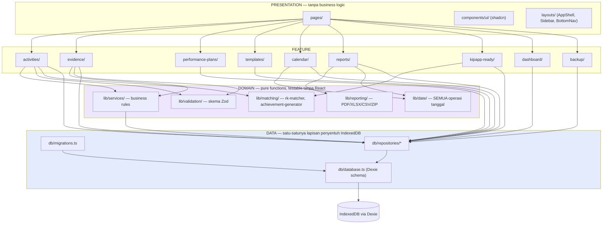
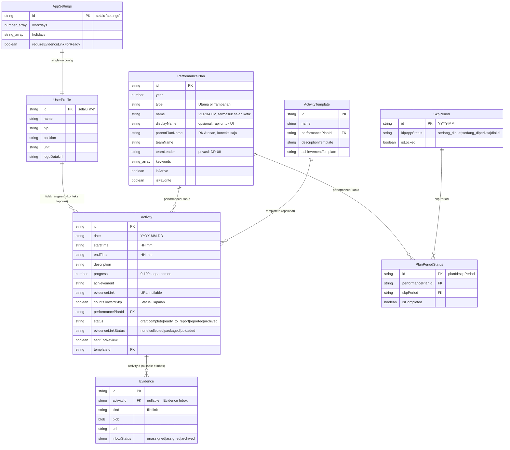
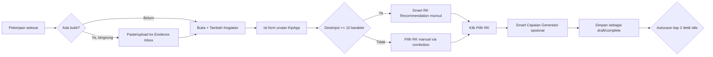
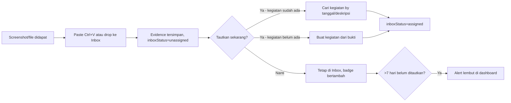
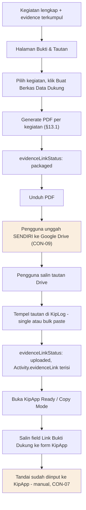
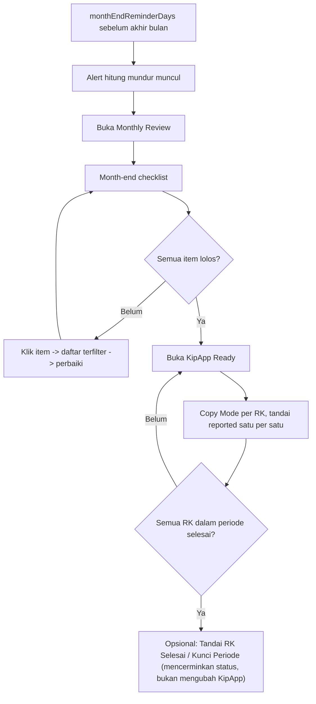

# DELIVERABLE 0 — GERBANG DESAIN
## KipLog BPS v3.1

Status: **disetujui, implementasi selesai (Fase 1–7)**. Dokumen ini dibiarkan
apa adanya sebagai catatan desain awal — untuk keputusan yang berubah sejak
disetujui, lihat [ASSUMPTIONS.md](ASSUMPTIONS.md).

---

## 1. Diagram Arsitektur



**Aturan yang ditegakkan diagram ini (ARCH-01…04):** komponen React tidak pernah memanggil Dexie langsung — selalu lewat `Repo`; seluruh business logic berada di `lib/` sebagai fungsi murni; tidak ada panah keluar dari kotak manapun menuju jaringan eksternal (CON-05, CON-06, SEC-02, SEC-03).

---

## 2. ERD Model Data



Skema Dexie v1 (indeks) sesuai §9.5 — tidak diulang di sini untuk menghindari drift; rujukan tunggal tetap PRD §9.5.

---

## 3. Diagram Alur Pengguna

### 3a. Alur harian (capture-organize loop)



### 3b. Alur Evidence Inbox



### 3c. Alur inti Data Dukung → unggah → tautan → KipApp (fitur pembeda utama, §3.1)


Kotak oranye = aksi manual pengguna di luar KipLog (KipLog tidak pernah melakukannya otomatis).

### 3d. Alur akhir bulan



---

## 4. Sitemap

| Rute (HashRouter) | Halaman | Fase |
|---|---|---|
| `#/` | Dashboard | 1/6 |
| `#/kalender` | Kalender (month/week/day) | 2 |
| `#/kegiatan` | Daftar Kegiatan | 2 |
| `#/kegiatan/:id` | Detail Kegiatan | 2 |
| `#/evidence-inbox` | Evidence Inbox | 3 |
| `#/bukti-tautan` | Bukti & Tautan (Kanban) | 5 |
| `#/rencana-kinerja` | Master Rencana Kinerja (CRUD + import) | 1/4 |
| `#/template` | Template CRUD | 4 |
| `#/kipapp-ready` | KipApp Ready + Copy Mode | 6 |
| `#/laporan` | Reports & Export | 5 |
| `#/review` | Monthly/Weekly Review | 6 |
| `#/backup` | Backup & Import (termasuk import Excel KipApp) | 5/7 |
| `#/pengaturan` | Pengaturan + My Profile | 1 |
| `#/onboarding` | Onboarding pertama kali | 1 |

Tidak ada rute tersembunyi di luar daftar ini — cakupan sitemap = cakupan navigasi §14.3.

---

## 5. Konfirmasi Keputusan Teknis (§11) & Asumsi

Stack §11 diperlakukan sebagai **final**, tidak dikonfirmasi ulang per item (React 18 + TS strict, Vite 5, HashRouter, Tailwind 3, shadcn/ui, Dexie 4, Zustand, react-hook-form + zod, date-fns, Fuse.js, pdfmake, exceljs, jszip, recharts, browser-image-compression, vite-plugin-pwa, Vitest).

**Keputusan teknis kecil yang akan dicatat di `docs/ASSUMPTIONS.md` saat muncul selama implementasi** (sesuai §0.2 — tidak menghentikan pekerjaan, hanya dicatat):
- Struktur import path (`@/` alias vs relatif).
- Konvensi penamaan file komponen (PascalCase.tsx — default React).
- Library ikon provider-detection untuk FR-EVD-10 (regex sederhana vs daftar domain).

**Yang TIDAK termasuk kategori ini (butuh persetujuan eksplisit sebelum dikerjakan) — lihat §7 Pertanyaan Terbuka.**

---

## 6. Wireframe Dashboard

**Desktop** — identik dengan §14.4 PRD, tidak diulang untuk menghindari drift dari sumber.

**Mobile (< 768px):**
```
┌─────────────────────────┐
│ KipLog          [🔍][⋯] │
├─────────────────────────┤
│ Selamat pagi, <Nama>    │
│ Agustus 2026            │
│ ⏳ 5 hari kerja tersisa  │
├─────────────────────────┤
│ ┌───────┐ ┌───────┐     │
│ │Coverage│ │Kegiatan│    │
│ │  80%   │ │  32   │    │
│ └───────┘ └───────┘     │
│ ┌───────┐ ┌───────┐     │
│ │ Bukti │ │Bertautan│   │
│ │  48   │ │  20/32  │   │
│ └───────┘ └───────┘     │
├─────────────────────────┤
│ Perlu Perhatian         │
│ • 12 belum bertautan    │
│ • 2 tanpa bukti         │
├─────────────────────────┤
│ Kegiatan Terbaru        │
│ [Activity Card] [Card]  │
│ [Activity Card] [Card]  │
├─────────────────────────┤
│ [🏠] [📅] [ + ] [📎] [📋]│  ← bottom nav + FAB tengah
└─────────────────────────┘
```

---

## 7. Wireframe Kalender (Month View)

```
┌──────────────────────────────────────────────────────┐
│ ‹  Agustus 2026  ›            [Bulan|Minggu|Hari]  [T]│
├────┬────┬────┬────┬────┬────┬────┬───────────────────┤
│ Sen│ Sel│ Rab│ Kam│ Jum│ Sab│ Min│                    │
├────┼────┼────┼────┼────┼────┼────┤                    │
│    │    │    │    │  1 │  2 │  3 │  legenda:          │
│    │    │    │    │ ●2 │ ○▫ │(neutral)│ ● lengkap+link │
├────┼────┼────┼────┼────┼────┼────┤  ○ draft           │
│  4 │  5 │  6 │  7 │  8 │  9 │ 10 │  ▫ tanpa bukti(clip)│
│┊--┊│ ●3 │ ●1 │ ◐2 │[8]●│(nt)│(nt)│  ◐ progress<100    │
├────┼────┼────┼────┼────┼────┼────┤  ┊--┊ kerja kosong  │
│ ...                                  [8] = hari ini    │
└──────────────────────────────────────────────────────┘
```
Setiap simbol warna disertai bentuk berbeda (WCAG 1.4.1) — dot penuh vs outline vs ikon klip-coret vs rantai-putus, sesuai tabel indikator §10.2.

---

## 8. Wireframe Form Tambah Kegiatan

Urutan field **persis sama** dengan urutan input KipApp (§2.2), termasuk field milik KipLog di luar itu ditempatkan setelah, bukan menyisip di tengah:

```
┌─────────────────────────────────────────────┐
│ Tambah Kegiatan                        [✕]  │
├─────────────────────────────────────────────┤
│ 1  Tanggal            [📅 02 Agu 2026    ]  │
│ 2  Jam mulai kegiatan [08:00]                │
│ 3  Jam selesai kegiatan[10:30]  → 2j 30m     │
│ 4  Deskripsi kegiatan                        │
│    [___________________________________]    │
│    ┌─ Rekomendasi RK (muncul >=10 karakter)─┐│
│    │ ● RK #2 Kesejahteraan Rakyat  92%      ││
│    │   cocok: snlik, petugas   [Pilih]      ││
│    │ ● RK #16 Sensus Ekonomi 2026  41%      ││
│    │   [Pilih]           [Cari lainnya]     ││
│    └─────────────────────────────────────────┘│
│ 5  Progress kegiatan  [====75%===] [75] [0][25][50][75][100]│
│ 6  Capaian hasil kegiatan     [Sarankan capaian]│
│    [___________________________________]    │
│ 7  Link bukti dukung  [https://___] [Tempel][Buka]│
│ 8  Status capaian     ( ) Masukkan ke capaian SKP│
│                        default: settings      │
├─────────────────────────────────────────────┤
│ RK terpilih: [Kesra ▾]  Tag: [+]  Lokasi:[__]│
│ Area RB: [ ] [ ] ...                         │
├─────────────────────────────────────────────┤
│           [Batal]        [Simpan Draft/Selesai]│
└─────────────────────────────────────────────┘
```
Jika `sentForReview` atau periode `isLocked`, seluruh form ini read-only dengan pesan §9.4/§17.1.

---

## 9. Wireframe Evidence Inbox

```
┌──────────────────────────────────────────────┐
│ Evidence Inbox      [Unassigned ③|Assigned|Archived]│
├──────────────────────────────────────────────┤
│ ┌────────────────────────────────────────┐   │
│ │     ⬆  Tarik bukti ke sini              │   │
│ │     atau [Pilih File] · tempel ⌘V       │   │
│ └────────────────────────────────────────┘   │
├──────────────────────────────────────────────┤
│ [thumb] screenshot-01.png   2 Agu 08:15      │
│         [Tautkan ke kegiatan] [Buat kegiatan]│
│         [☐ pilih untuk multi-select]         │
│ [thumb] surat-tugas.pdf     1 Agu 14:02      │
│         [Tautkan ke kegiatan] [Buat kegiatan]│
├──────────────────────────────────────────────┤
│ ⚠ 3 bukti belum ditautkan lebih dari 7 hari  │
└──────────────────────────────────────────────┘
```

---

## 10. Wireframe KipApp Ready (berkelompok per RK)

Identik dengan §14.6 PRD (dua kolom: Data KipLog | Siap tempel ke KipApp, urutan field sama persis form KipApp) — tidak diulang untuk menghindari drift.

---

## 11. Wireframe Bukti & Tautan (Kanban 4 kolom)

```
┌───────────────────────────────────────────────────────────────┐
│ Bukti & Tautan                    [Buat Berkas Data Dukung ▾] │
├───────────────┬───────────────┬───────────────┬───────────────┤
│ Belum ada     │ Bukti         │ Berkas         │ Tautan        │
│ bukti (none)  │ terkumpul     │ dibuat         │ tersimpan     │
│               │ (collected)   │ (packaged)     │ (uploaded)    │
├───────────────┼───────────────┼───────────────┼───────────────┤
│ [card] 3 Agu  │ [card] 2 Agu  │ [card] 30 Jul  │ [card] 28 Jul │
│ Rapat Koordi… │ Input SNLIK   │ Monitoring SE  │ Input SNLIK   │
│ RK: -         │ 📎2            │ 📎1 PDF siap    │ 🔗 tertaut    │
│               │               │ [Unduh][Panduan]│              │
│ [card] 4 Agu  │               │                │ [card] 27 Jul │
├───────────────┴───────────────┴───────────────┴───────────────┤
│ 12 kegiatan sudah berberkas tetapi belum bertautan             │
│ Tempel tautan massal: [textarea, satu baris per kegiatan]      │
└───────────────────────────────────────────────────────────────┘
```
Panduan 3 langkah muncul setelah "Berkas dibuat": unduh → unggah ke Drive Anda sendiri → tempel tautan di sini (CON-09).

---

## 12. Roadmap Implementasi (rincian tugas per fase)

| Fase | Tugas utama | Estimasi* |
|---|---|---|
| **1 — Fondasi** | Scaffold Vite+React+TS strict; Tailwind+shadcn+token; HashRouter+AppShell; skema Zod+tipe; Dexie v1+repo; seed 40 RK; Pengaturan+My Profile; onboarding; ESLint/Prettier/Vitest; first deploy | 3–4 sesi kerja |
| **2 — Kegiatan & Kalender** | Kalender month/week/day+indikator; Day Panel; form kegiatan urutan KipApp; RK combobox fuzzy; autosave; daftar+card; Duplicate; hari kerja/coverage; penguncian | 4–5 sesi |
| **3 — Bukti Dukung** | Upload drag/drop/paste; kompresi+thumbnail; Gallery; preview modal; link evidence; kuota; Evidence Inbox | 3–4 sesi |
| **4 — Produktivitas** | Template CRUD; tag; global search ⌘K; filter+chip; Smart RK Recommendation (§12.1, 5 uji wajib); Smart Capaian Generator; validator Ready to Report; Duplicate rentang | 4–5 sesi |
| **5 — Pelaporan & Tautan** | PDF Data Dukung §13.1; PDF rentang; Excel; CSV/JSON; Link Registry Kanban; Evidence Pack ZIP; backup export/import; Delete All | 4–5 sesi |
| **6 — KipApp Ready & Review** | Halaman berkelompok per RK; Copy Mode 2 kolom; reported+PlanPeriodStatus; penguncian periode; Dashboard lengkap; Monthly/Weekly Review; month-end checklist | 3–4 sesi |
| **7 — Penyempurnaan** | Responsif audit; PWA; a11y audit (WCAG 2.1 AA); empty state+error message; lazy-load; performa; import Excel KipApp; README+docs | 3–4 sesi |

*Estimasi dalam "sesi kerja" (bukan jam kalender) karena kecepatan bergantung pada seberapa cepat setiap gerbang fase disetujui.

Setiap fase diakhiri `npm run verify` bersih → laporan singkat → **BERHENTI**, sesuai aturan gerbang §20.

---

## 13. Daftar Pertanyaan Terbuka

Butuh jawaban Anda sebelum atau selama implementasi (bukan keputusan teknis kecil — ini memengaruhi data/scope):

1. **Privasi `teamLeader` (DR-08):** File `performance-plans-2026.ts` yang sudah ada berisi nama Ketua Tim asli. Apakah repository project ini akan **dipublikasikan** (GitHub public) atau tetap privat/lokal? Ini menentukan apakah perlu memisahkan ke `.example.ts` tanpa nama sebelum Fase 1 seeding, atau boleh dipakai apa adanya karena tetap privat.
2. **Profil pengguna asli:** Nama, NIP, jabatan, unit kerja — diisi langsung oleh Anda saat onboarding runtime, atau ada nilai default yang perlu di-seed untuk kop laporan?
3. **Logo:** Tersedia file logo BPS dan logo Zona Integritas (untuk kop PDF §13.1)? Jika ada, di mana lokasinya agar bisa dimasukkan ke `public/`?
4. **Nama repository GitHub Pages:** `vite.config.ts` `base` harus sama persis dengan nama repo (§11.1) — nama repo yang akan dipakai apa? (memengaruhi setup Fase 1 dan `.github/workflows/deploy.yml`)
5. **Hari libur nasional 2026:** Seed `holidays-id.ts` perlu daftar SKB 3 Menteri 2026 — apakah Anda punya daftar resminya, atau saya cari dari sumber publik yang Anda anggap sahih?
6. **Zona waktu:** Default `Asia/Makassar` (WITA) sesuai PRD — konfirmasi ini benar untuk lokasi kerja Anda (BPS Kabupaten mana)?

---

**BERHENTI.** Menunggu persetujuan Anda untuk lanjut ke Fase 1, atau koreksi atas Deliverable 0 ini.
